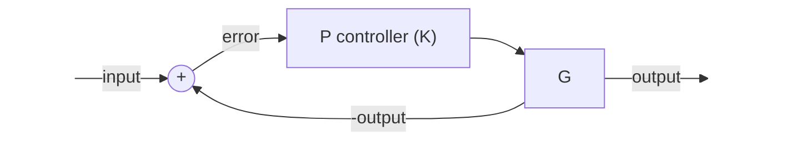
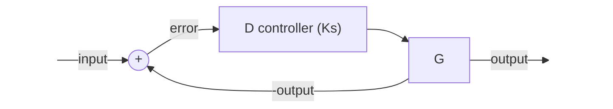

# PID based optimizer for neural network #

## PID ##
$$
\begin{equation}
u(t) = K_p e(t) + K_i \sum_{i=0}^{t-1} e(i) +K_d \left( e(t) - e(t-1) \right) \label{PID}
\end{equation}
$$
$u(t)$: controller's update

$e(t)$: the error between the system's output and the set point

### steady-state error ###

**P controller**

$$
E_{ss} = R_{ss} - Y_{ss} = R_{ss} - E_{ss} K G
$$
$$
E_{ss} = R_{ss} / (1 + K G)
$$
With only the proportional controller $P$, the steady-state error $e_{ss} \neq 0$ as long as $r_{ss} \neq 0$.

**I controller**

$$
E_{ss} = R_{ss} - Y_{ss} = R_{ss} - E_{ss} K G / s
$$
$$
E_{ss} = R_{ss} s / (s + K G)
$$
For sinusoid input signal $R_{ss} = \frac{\omega}{s^2 + \omega^2}$,
$$
E_{ss} = \frac{\omega}{s^2 + \omega^2} \frac{s}{s + K G}
$$
According to the final value theorem,
$$
e_{\infty} = \lim_{s \to 0} s E_{ss} = \omega \lim_{s \to 0} \frac{s^2}{(s^2 + \omega^2) (s+KG)} = 0
$$

**D controller**

$$
E_{ss} = R_{ss} - Y_{ss} = R_{ss} - E_{ss} KGs
$$
$$
E_{ss} = R_{ss} / (1+KGs)
$$
For sinusoid input signal $R_{ss} = \frac{\omega}{s^2 + \omega^2}$,
$$
E_{ss} = \frac{\omega}{s^2 + \omega^2} \frac{1}{1+KGs}
$$
According to the final value theorem,
$$
e_{\infty} = \lim_{s \to 0} sE_{ss} = \omega \lim_{s \to 0} \frac{s}{(s^2+\omega^2) (1+KGs)} = 0
$$

## stochastic gradient descent (SGD) ##

the update rule of SGD:
$$
\begin{equation}
\theta_{t+1} - \theta_{t} = - r \frac{\partial L_t}{\partial \theta_t} \label{SGD}
\end{equation}
$$
$\theta_{t+1}-\theta_t$: update

$r$: the learning rate

## SGD-momentum ##

the update rule of SGD-momentum:
$$
\begin{equation}
\begin{cases}
        V_{t+1} = \alpha V_t - r \frac{\partial L_t}{\partial \theta_t} \\
        \theta_{t+1} = \theta_t + V_{t+1}
\end{cases} \label{momentum}
\end{equation}
$$
The momentum can be derived as,
$$
V_{t+1} = -r \sum_{i=0}^t  \alpha^{t-i} \frac{\partial L_i}{\partial \theta_i}
$$
where $V_0 := 0$ with loss of generality.

so the update is:
$$
\theta_{t+1} - \theta_t = -r \frac{\partial L_t}{\partial \theta_t} -r \sum_{i=0}^{t-1} \alpha^{t-i} \frac{\partial L_i}{\partial \theta_i}
$$

## Laplace transform ##

The Laplace transform of the PID equation $\eqref{PID}$ is,
$$
U(s) = \left( K_p + K_i / s + K_d \cdot s \right) E(s)
$$
$$
\theta(s) = (K_p + K_i / s + K_d s) (\theta^*/s - \theta(s)) \\
\theta(s) = A \theta^* / s - A \theta(s) \\
\theta(s) = \frac{A \theta^*}{s (1+A)}
$$

scripts:
$$
G(s) = \int_0^{\infty} \exp(-st) g(t) \,dt
$$
initial value theorem
$$
g(0) = \lim_{s \to \infty} sG(s)
$$
final value theorem
$$
g(\infty) = \lim_{s \to 0} sG(s)
$$
recall that
$$
\mathscr{L}[\dot{g}(t)] = sG(s) - g(0)
$$
$$
\lim_{s \to 0} sG(s) = \lim_{s \to 0} \int_0^{\infty} \exp(-st) \dot{g}(t) \,dt + g(0) = \int_0^{\infty} \dot{g}(t) \,dt + g(0)
$$

### second-order systems ###
$$
G(s) = \frac{Num(s)}{s^2+2 \zeta \omega_n s + \omega_n^2} = \frac{Num(s)}{(s+\sigma)^2 + \omega_d^2}
$$
two poles,
$$
s = -\zeta \omega_n \pm \omega_n \sqrt{\zeta^2 - 1}
$$
where $\zeta$ is *damping ratio* and $\omega_n$ is *un-damped natural frequency*.
