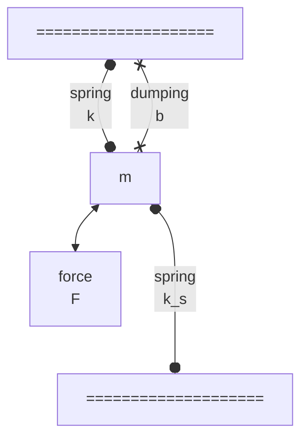

## Contact mode AFM ##

$$
\begin{equation}
m \ddot{z} = -b \ddot{z} - (k+k_s) z + k_s B \sin(\frac{2\pi \dot{x} t}{\lambda}) + F_0
\label{CM-AFM}
\end{equation}
$$
where $x$ and $z$ are lateral and vertical positions of the tip, $\dot{x}$ represents the scaning spped, $\lambda$ is sample spatial frequency, $m$, $k$ and $b$ are mass, stiffness and dumping coefficient of the cantilever, $k_s$ is the sample stiffness and $F_0$ is exteral force.

The equation $\eqref{CM-AFM}$ can be solved generally by [Laplace transform](https://psichen.github.io/2023/09/01/solving-differential-equations-by-transform/), and the solution is,

## References ##
1. [Yang, Chen, et al. "High-speed atomic force microscopy in ultra-precision surface machining and measurement: challenges, solutions and opportunities." Surface Science and Technology 1.1 (2023): 7.](https://link.springer.com/article/10.1007/s44251-023-00006-5)
2. [A system dynamics approach to user independence in high speed atomic force microscopy](https://dspace.mit.edu/handle/1721.1/61594)
