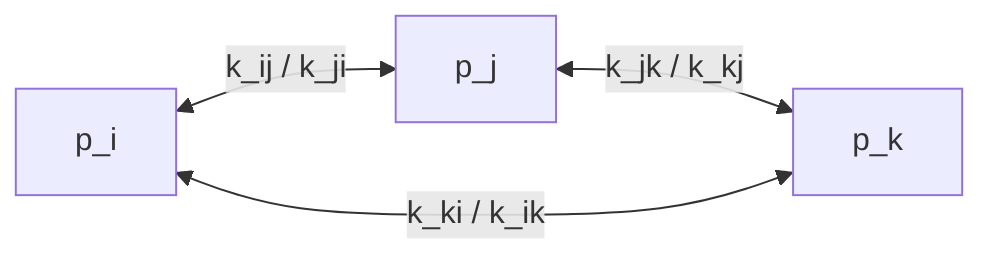

## Master equation ##

## Markov chain ##

## Wegscheider conditions ##

For each oriented cycle of elementary processes the product of kinetic constants is equal to the product of kinetic constants of the reverse processes.

Let's consider a circular reaction,

We therefore have as the conditions imposed by the principle of detail balancing,
$$
k_{ij} p_i = k_{ji} p_j \\
k_{jk} p_j = k_{kj} p_k \\
k_{ki} p_k = k_{ik} p_i \\
$$
where $k_{ij}$ is the rate constant of the reaction $i \rightarrow j$. So we can get the Wegscheider condition by timing all the above equations. In general case, for every pathway connecting states $i_n, (n=0,1,\dots,n)$, the Wegscheider condition is,
$$
\frac{k_{i_0, i_1} k_{i_1, i_2} \cdots k_{i_n, i_0}}{k_{i_1, i_0} k_{i_2, i_1} \cdot k_{i_0 i_n}} = 1
$$
It can be shown mathematically that if and only if the Wegscheider condition is satisified for every possible cycle in the kinetic network, then the entire system is at equilibrium, and its stochastic dynamic is time-reversible.

## Probability transition matrix ##

For the reaction $A_i \leftrightarrow A_j (i,j = 1,2,\cdots, N; i \neq j)$, we can get the *rate matrix* from the master equation,
$$
\frac{d \boldsymbol{A}}{d t} = \boldsymbol{K} \boldsymbol{A}
$$
where the rate matrix $\boldsymbol{K}$ is,
$$
\boldsymbol{K} = 
\begin{bmatrix}
-\sum_{\nu \neq 1} k_{1 \nu} & k_{21} & k_{31} & \cdots & k_{N1} \\
k_{12} & -\sum_{\nu \neq 2} k_{2 \nu} & k_{32} & \cdots & k_{N2} \\
\vdots & \vdots & \vdots & \ddots & \vdots \\
k_{1N} & k_{2N} & k_{3N} & \cdots & -\sum_{\nu \neq N} k_{N \nu} \\
\end{bmatrix}
$$

Solving the above differential equation,
$$
\boldsymbol{A} = \exp (\boldsymbol{K} t) \boldsymbol{A}_0 = \boldsymbol{X} \exp(\boldsymbol{\Lambda} t) \boldsymbol{X}^{-1} \boldsymbol{A}_0 
$$
where $\boldsymbol{X}$ and $\boldsymbol{\Lambda}$ are eigenvectors and eigenvalues of the rate matrix $\boldsymbol{K}$ respectively. For more details about [exponential function of matrices](https://psichen.github.io/2021/03/27/notes-about-fluorescence-correlation-spectroscopy-formalism/).
