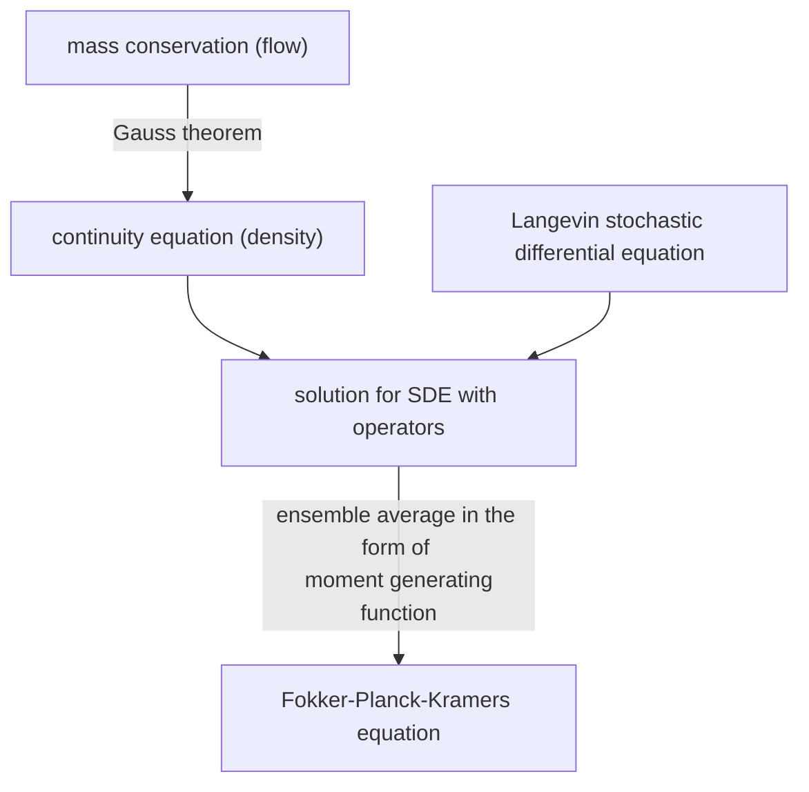

Fokker-Planck-Kramers equation is a stochastic differential function describing the motion in phase space. It can degenerate to diffusion function (in coordinate space) or Fokker-Planck function (in velocity space).

The post describes the derivation of FPK equation from moment generating function.

<!--more-->

## Solution to the stochastic differential equation

### Continuity equation

For a conserved system, the change of mass with respect to time is equal to the flow arround the surface,

$$ \iiint \partial_{t} \rho \ dV = - \iint \dot{\pmb{r}} \rho \ dS $$

According to Guass theorem, we get the continuity equation,

$$ \begin{equation}
\partial_{t} \rho = - \nabla \cdot ( \dot{\pmb{r}} \rho ) \label{continuity}
\end{equation} $$

### Langevin SDE

Inserting Langevin stochastic differential equation,

$$ \begin{equation}
\dot{\pmb{r}} = \pmb{f}(\pmb{r}) + \pmb{g}(\pmb{r}) \eta(t) \label{Langevin}
\end{equation} $$

we get,

$$ \partial_{t} \rho = - \nabla \cdot [ \pmb{f}(\pmb{r}) \rho ] - \eta(t) \nabla \cdot [ \pmb{g}(\pmb{r}) \rho ] = ( \mathcal{L}_{d} + \mathcal{L}_{s} ) \rho $$

where the operator $\mathcal{L}_{d} = - \nabla \cdot [ \pmb{f}(\pmb{r}) ]$ is deterministic and the operator $\mathcal{L}_{s} = - \eta(t) \nabla \cdot [ \pmb{g}(\pmb{r}) ]$ is stochastic because of the term $\eta(t) \sim \mathcal{N}(0, 2\kappa)$.

The solution to the above stochastic differential equation is,

$$ \rho(t) = \exp(\mathcal{L}_{d} t + \int_{0}^{t} \mathcal{L}_{s} \ d{t'}) \rho(0) $$

## Ensemble average in the form of MGF

### polynomial form of exponential function
The property of the stochastic term $\eta(t)$ can be evaluated by taking ensemble average to the solution,

$$ \begin{equation}
<\rho> = \exp( \mathcal{L}_{d} t ) < \exp(\int_{0}^{t} \mathcal{L}_{s} \ d{t'}) > \rho(0) \label{ensemble}
\end{equation} $$

The exponential function $<\exp(\int_{0}^{t} \mathcal{L}_{1} \ d{t'})>$ has a polynomial form,

$$ <\exp(\int_{0}^{t} \mathcal{L}_{s} \ d{t'})> = \sum_{k=0}^{\infty} \frac{ <(\int_{0}^{t} \mathcal{L}_{s} \ d{t'})^{k}> }{k!} $$

We only need to know $<\int_{0}^{t} \mathcal{L}_{s} \ d{t'}>$ and $<(\int_{0}^{t} \mathcal{L}_{s} \ d{t'})^{2}>$, which are,

$$ <\int_{0}^{t} \mathcal{L}_{s} \ d{t'}> = - \int_{0}^{t} <\eta(t')> \nabla \cdot [ \pmb{g}(\pmb{r}) ] \ d{t'} = 0 $$

and,

 $$ \begin{aligned}
< (\int_{0}^{t} \mathcal{L}_{s} \ d{t'})^{2} > &= \int_{0}^{t} \int_{0}^{t} \nabla \cdot \big[ \pmb{g}(\pmb{r}(t_{1})) \nabla \cdot [ \pmb{g}(\pmb{r}(t_{2})) ] \big] <\eta(t_{1}) \eta(t_{2})> \ d{t_{1}} d{t_{2}} \\
&= 2 \kappa \int_{0}^{t} \int_{0}^{t} \nabla \cdot \big[ \pmb{g}(\pmb{r}(t_{1})) \nabla \cdot [ \pmb{g}(\pmb{r}(t_{2})) ] \big] \delta(t_{1} - t_{2}) \ d{t_{1}} d{t_{2}} \\
&= 2 \kappa \int_{0}^{t} \nabla \cdot \big[ \pmb{g}(\pmb{r}(t_{1})) \nabla \cdot [ \pmb{g}(\pmb{r}(t_{1})) ] \big] \ d{t_{1}}
 \end{aligned} $$

 It should be noticed that the square of operator $\mathcal{L}^{2} f$ is equivalent to $\mathcal{L} [ \mathcal{L} f]$.

### MGF for Gaussian variables

$<\exp( \int_{0}^{t} \mathcal{L}_{s} \ d{t'} )>$ is [the moment generating function](https://www.psichen.com/2021/02/11/generating-functions-of-probability-distribution/) $M_{X}(\tau)$ of variable $X = \int_{0}^{t} \mathcal{L}_{s} \ d{t'}$ when $\tau = 1$. The integral of Gaussian variable $\eta(t)$ is also Gaussian, thus [its moment generating function](https://www.psichen.com/2021/03/10/common-probability-density-functions/) is,

$$ M_{X}(1) = \exp( \mu + \frac{\sigma^{2}}{2} ) $$

Substituting it into the equation $\eqref{ensemble}$,

$$ <\rho> = \exp(\mathcal{L}_{0} t) \exp( \kappa \int_{0}^{t} \nabla \cdot \big[ \pmb{g}(\pmb{r})\nabla \cdot [ \pmb{g}(\pmb{r}) ] \big] \ d{t'} ) \rho_{0} $$

## Partial derivative of time

Then we take the partial derivative of $<\rho>$ with respect to time,

$$ \begin{equation}
\partial_{t} <\rho> = - \nabla \cdot [\pmb{f} <\rho>] + \kappa \nabla \cdot \big[ \pmb{g} \nabla \cdot [\pmb{g} <\rho>] \big] = \mathcal{L} <\rho> \label{FPK}
\end{equation} $$

where the operator $\mathcal{L} = - \nabla \cdot \big[ \pmb{f} - \kappa \pmb{g} \nabla \cdot [\pmb{g}] \big]$.

We only take out the integrand in the exponential factor $\exp( \kappa \int_{0}^{t} \nabla \cdot \big[ \pmb{g}(\pmb{r}) \nabla \cdot [ \pmb{g}(\pmb{r}) ] \big] \ d{t'})$ instead of deriving $\pmb{g}$ and $\pmb{r}$ continuingly. Because the partial derivative with respect to time is the change along with time at a fixed position $\pmb{r}$. It's the total derivative that all functions need to be derived with respect to time.

The equation $\eqref{FPK}$ is what we want, namely the Fokker-Planck-Kramers equation.

## References

1. [Brownian Motion: Fokker-Planck Equation](http://physics.gu.se/~frtbm/joomla/media/mydocs/LennartSjogren/kap7.pdf)
