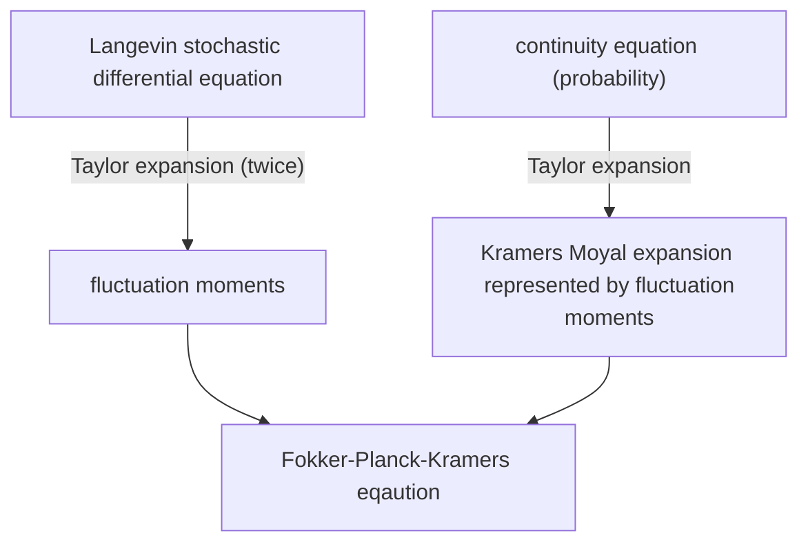

Fokker-Planck-Kramers equation is a stochastic differential function describing the motion in phase space. It can degenerate to diffusion function (in coordinate space) or Fokker-Planck function (in velocity space).

The post describes the derivation of FPK equation from Kramers Moyal expansion by Taylor series.

 <!--more-->

## Kramers Moyal expansion

In the stochastic motion, we don't care about the coordinates in phase space at initial or final time, because they are arbitrary. But we want to study their changes $\Delta \pmb{r}$ in phase space $\Omega$ after an infinitesimal time interval $\Delta t$. Let's assume the particles' moving is a Markovian process, so the inference of probability density $\rho$ is,

$$ \begin{aligned}
\rho(\pmb{r}, t+\Delta t) &= \int_{\Omega} \rho(\pmb{r}, t+\Delta t | \pmb{r}', t) \rho(\pmb{r}', t) \ d{\pmb{r'}} \\
\color{blue}{[\Delta \pmb{r} \equiv \pmb{r} - \pmb{r}']} &= \int \rho(\pmb{r}, t+\Delta t | \pmb{r} - \Delta \pmb{r}, t) \rho(\pmb{r}-\Delta \pmb{r}, t) \ d{\Delta \pmb{r}}
\end{aligned} $$

It should be noticed that $\pmb{r}$ and $\Delta \pmb{r}$ are two independent variables, which means the order of operators about $\pmb{r}$ and $\Delta \pmb{r}$ is interchangeable. Let's expand the integrand of RHS into Taylor series in phase space,

$$ \begin{aligned}
\text{RHS} &= \int \rho(\pmb{r}+\Delta \pmb{r}-\Delta \pmb{r}, t+\Delta t | \pmb{r} - \Delta \pmb{r}, t) \rho(\pmb{r}-\Delta \pmb{r}, t) \ d{\Delta \pmb{r}} \\
\color{blue}{[\text{expand by } -\Delta \pmb{r}]} &= \int \sum_{n=0}^{\infty} \frac{(\Delta \pmb{r})^{n}}{n!} (-\partial_{r})^{n} \Big[ \rho(\pmb{r}+\Delta \pmb{r}, t+\Delta t | \pmb{r}, t) \rho(\pmb{r}, t) \Big] \ d{\Delta \pmb{r}} \\
\color{blue}{[\text{independent variables}]} &= \sum_{n=0}^{\infty} (-\partial_{r})^{n} \Big[ \rho(\pmb{r}, t) \frac{1}{n!} \int (\Delta \pmb{r})^{n} \rho(\pmb{r}+\Delta \pmb{r}, t+\Delta t | \pmb{r}, t) \ d{\Delta \pmb{r}} \Big] \\
&= \sum_{n=0}^{\infty} (-\partial_{r})^{n} \Big[ \rho(\pmb{r},t) \frac{< (\Delta \pmb{r})^{n} >}{n!} \Big] \\
&= \rho(\pmb{r}, t) + \sum_{n=1}^{\infty} (-\partial_{r})^{n} \Big[ \rho(\pmb{r},t) \frac{< (\Delta \pmb{r})^{n} >}{n!} \Big]
\end{aligned} $$

The particles changes $\Delta \pmb{r}$ after $\Delta t$ (which is independent of the variable $t$), so $\Delta \pmb{r}$ should be a function of $\Delta t$, and the $n$th moment $M_{n}$ should be a function of $\Delta t$ as well,

$$ M_{n}(\Delta t) = < (\Delta \pmb{r})^{n} > = \partial_{\Delta t} M_{n}(0) \Delta t + O(\Delta t^{2})$$

Here $M_{n}(0) = 0$ because when $\Delta t = 0$, the probability $\rho(\pmb{r}+\Delta \pmb{r}, t | \pmb{r}, t) = \delta(\Delta \pmb{r})$, which has zero moments.

Expand LHS into Taylor series in time space, 

$$ \text{LHS} = \rho(\pmb{r}, t) + \Delta t \partial_{t} \rho(\pmb{r}, t) $$

Take LHS and RHS together, we get the Kramers Moyal expansion,

$$ \partial_{t} \rho(x,t) = \sum_{n=1}^{\infty} \frac{1}{n!} (-\partial_{r})^{n} \Big[ \rho(\pmb{r}, t) \partial_{\Delta t}M_{n}(0) \Big] $$

Usually we denote,

$$ D^{(n)} = \partial_{\Delta t} M_{n}(0)/n! $$

$D^{(1)}$ is called drift coefficient and $D^{(2)}$ is called diffusion coefficient.

## Langevin stochastic differential equation

The relation between $\Delta \pmb{r}$ and $\Delta t$ is determined by equation of motion, which could be the Langevin equation. The general form of Langevin stochastic differential equation is,

$$ \dot{\pmb{r}}(t) = \pmb{f}(\pmb{r}(t)) + \pmb{g}(\pmb{r}(t)) \eta(t) $$

The $\eta(t)$ is Gaussian noise which has ensemble averages,

$$ \begin{aligned}
< \eta(t) > &= 0 \\
< \eta(t_{1}) \ \eta(t_{2}) > &= 2 \kappa \delta(t_{2} - t_{1})
\end{aligned} $$

Let's suppose from time $t_{0}$ to time $t_{0}+\Delta t$, the change in phase space $\Delta \pmb{r}$ is,

$$ \Delta \pmb{r} = \pmb{r}(t_{0}+\Delta t) - \pmb{r}(t_{0}) = \int_{t_{0}}^{t_{0}+\Delta t} [ \pmb{f}(\pmb{r}(t_{1})) + \pmb{g}(\pmb{r}(t_{1})) \eta(t_{1}) ] \ d{t_{1}} $$

Here we use the integral form instead of differential form $\Delta \pmb{r} = \dot{\pmb{r}} \Delta t$ because we need to conserve details of the integrand function.

### drift coefficient

Functions $\pmb{f}(\pmb{r}(t_{1}))$ and $\pmb{g}(\pmb{r}(t_{1}))$ can then be expanded into Taylor series dependent on $\Delta \pmb{r} = \pmb{r}(t_{1}) - \pmb{r}(t_{0})$ again. So we iteratively insert the Langevin equation into the integral to get higher-order moments (namely, $<\eta(t_{1}) \eta(t_{2})>$),

$$ \begin{aligned}
\pmb{f}(\pmb{r}(t_{1})) &= \pmb{f}(\pmb{r}(t_{0})) + \pmb{f}'(\pmb{r}(t_{0})) [ \color{blue}{\pmb{r}(t_{1}) - \pmb{r}(t_{0})} ] \\
&= \pmb{f}(\pmb{r}(t_{0})) + \pmb{f}'(\pmb{r}(t_{0})) \color{blue}{\int_{t_{0}}^{t_{1}} [ \pmb{f}(\pmb{r}(t_{2})) + \pmb{g}(\pmb{r}(t_{2})) \eta(t_{2}) ] \ d{t_{2}}} \\
\pmb{g}(\pmb{r}(t_{1})) &= \pmb{g}(\pmb{r}(t_{0})) + \pmb{g}'(\pmb{r}(t_{0})) [ \color{blue}{\pmb{r}(t_{1}) - \pmb{r}(t_{0})} ] \\
&= \pmb{g}(\pmb{r}(t_{0})) + \pmb{g}'(\pmb{r}(t_{0})) \color{blue}{\int_{t_{0}}^{t_{1}} [ \pmb{f}(\pmb{r}(t_{2})) + \pmb{g}(\pmb{r}(t_{2})) \eta(t_{2}) ] \ d{t_{2}}} \\
\end{aligned} $$

Substituting the expansion into $\Delta \pmb{r}$,

$$ \begin{aligned}
\Delta \pmb{r} &= \int_{t_{0}}^{t_{0}+\Delta t} \big[ \pmb{f}(\pmb{r}(t_{0})) + \pmb{f}'(\pmb{r}(t_{0})) \color{blue}{\int_{t_{0}}^{t_{1}} [ \pmb{f}(\pmb{r}(t_{2})) + \pmb{g}(\pmb{r}(t_{2})) \eta(t_{2}) ] \ d{t_{2}}} \big] \ d{t_{1}} \\
&+ \int_{t_{0}}^{t_{0}+\Delta t} \big[ \pmb{g}(\pmb{r}(t_{0})) + \pmb{g}'(\pmb{r}(t_{0})) \color{blue}{\int_{t_{0}}^{t_{1}} [ \pmb{f}(\pmb{r}(t_{2})) + \pmb{g}(\pmb{r}(t_{2})) \eta(t_{2}) ] \ d{t_{2}}} \big] \eta(t_{1}) \ d{t_{1}}
\end{aligned} $$

According to the upper and lower limit of definite integral, the time intervals have the inequality,

$$ t_{2} - t_{0} \le t_{1}- t_{0} \le \Delta t $$

So $t_{2}$ is close to $t_{0}$ thus a reasonable approximation can be made,

$$ \pmb{f}(\pmb{r}(t_{2})) \approx \pmb{f}(\pmb{r}(t_{0})) $$
$$ \pmb{g}(\pmb{r}(t_{2})) \approx \pmb{g}(\pmb{r}(t_{0})) $$

Then, recall that $<\eta> = 0$ and $<\eta(t_{1}) \eta(t_{2})> = 2 \kappa \delta(t_{2}-t_{1})$, let's take an ensemble average,

$$ \begin{aligned}
< \Delta \pmb{r} > &= \pmb{f}(\pmb{r}(t_{0})) \Delta t + \frac{1}{2} \pmb{f}'(\pmb{r}(t_{0})) \pmb{f}(\pmb{r}(t_{0})) \Delta t^{2} + \pmb{f}'(\pmb{r}(t_{0})) \pmb{g}(\pmb{r}(t_{0})) \cdot 0 \\
&+ \pmb{g}(\pmb{r}(t_{0})) \cdot 0 + \pmb{g}'(\pmb{r}(t_{0})) \pmb{f}(\pmb{r}(t_{0})) \cdot 0 + \pmb{g}'(\pmb{r}(t_{0})) \pmb{g}(\pmb{r}(t_{0})) \int_{t_{0}}^{t_{0}+\Delta t} \int_{t_{0}}^{t_{1}} < \eta(t_{1}) \eta(t_{2}) > \ d{t_{2}} d{t_{1}} \\
&= \pmb{f}(\pmb{r}(t_{0})) \Delta t + \frac{1}{2} \pmb{f}'(\pmb{r}(t_{0})) \pmb{f}(\pmb{r}(t_{0})) \Delta t^{2} + \pmb{g}'(\pmb{r}(t_{0})) \pmb{g}(\pmb{r}(t_{0})) \ 2 \kappa \ \int_{0}^{\Delta t} \ d{s_{1}} \int_{0}^{s_{1}} \delta(s_{2}-s_{1}) \ d{s_{2}} \\
&= \pmb{f}(\pmb{r}(t_{0})) \Delta t + \frac{1}{2} \pmb{f}'(\pmb{r}(t_{0})) \pmb{f}(\pmb{r}(t_{0})) \Delta t^{2} + \pmb{g}'(\pmb{r}(t_{0})) \pmb{g}(\pmb{r}(t_{0})) \kappa \Delta t
\end{aligned} $$

where $\int_{0}^{\Delta t} \ d{s_{1}} \int_{0}^{s_{1}} \delta(s_{2}-s_{1}) \ d{s_{2}} = \frac{1}{2} \int_{0}^{\Delta t} \int_{0}^{\Delta t} \delta(s_{2}-s_{1}) \ d{s_{2}} d{s_{1}} = \frac{1}{2} \Delta t$, because the integrated domain of the former is half of the latter.

So we get $D^{(1)}$,

$$ D^{(1)} = \partial_{\Delta t} M_{1}(0) = \pmb{f} + \kappa \pmb{g}' \pmb{g} $$

### diffusion coefficient

$D^{(2)}$ is equal to $\frac{1}{2} \partial_{\Delta t} < \Delta \pmb{r}^{2} >|_{\Delta t =0}$, because it has square, it's enough to expand $\Delta \pmb{r}$ separately once to get $2$nd moment,

$$ \Delta \pmb{r}^{2} = \int_{t_{0}}^{t_{0}+\Delta t} [ \pmb{f}(\pmb{r}(t_{1})) + \pmb{g}(\pmb{r}(t_{1})) \eta(t_{1}) ] \ d{t_{1}} \int_{t_{0}}^{t_{0}+\Delta t} [ \pmb{f}(\pmb{r}(t_{2})) + \pmb{g}(\pmb{r}(t_{2})) \eta(t_{2}) ] \ d{t_{2}} $$

Similarly, taking the ensemble average, we have,

$$ < \Delta \pmb{r}^{2} > = \pmb{f}^{2} \Delta t^{2} + 2 \pmb{g}^{2} \kappa \Delta t $$

So the diffusion coefficient $D^{(2)}$ is,

$$ D^{(2)} = \frac{1}{2} \partial_{\Delta t} M_{2}(0) = \pmb{g}^{2} \kappa $$

## Fokker-Planck-Kramers equation

From Kramers Moyal expansion, we can easily get the Fokker-Planck-Kramers equation, which desribes the particles' motion in phase space,

$$ \partial_{t} \rho = - \partial_{r} [ \rho (\pmb{f}+\kappa \pmb{g}' \pmb{g}) ] + \partial^{2}_{r} [ \rho \kappa \pmb{g}^{2} ] = - \partial_{r} [ \rho \pmb{f} - \kappa \pmb{g} \partial_{r} ( \rho \pmb{g} ) ] = \mathcal{L} \rho $$

where the operator $\mathcal{L} = - \partial_{r} [ \pmb{f} - \kappa \pmb{g} \partial_{r} \pmb{g}  ]$.

## References

1. [The Fokker-Planck Equation](https://www3.ul.ie/gleesonj/Papers/SDEs/AM4062_notes4.pdf)
