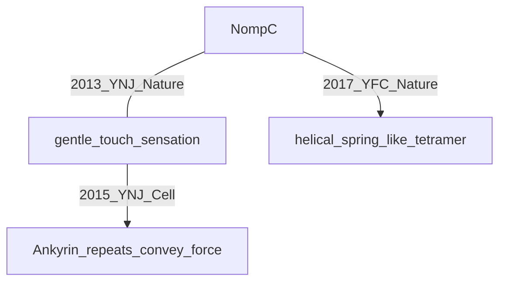
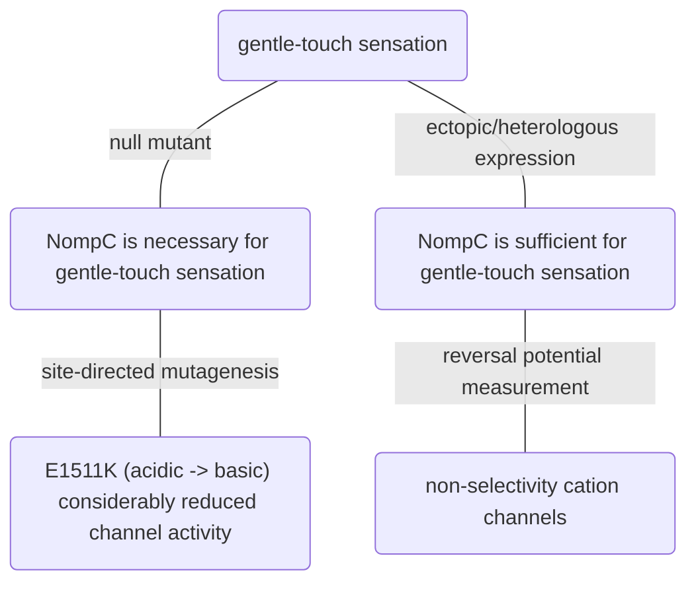
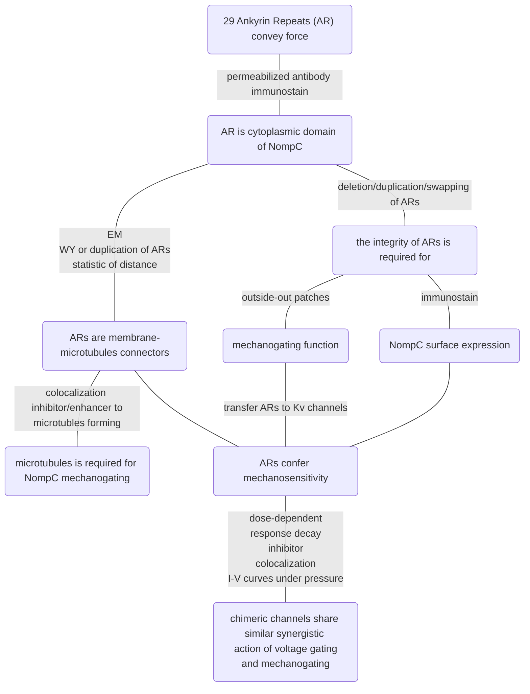
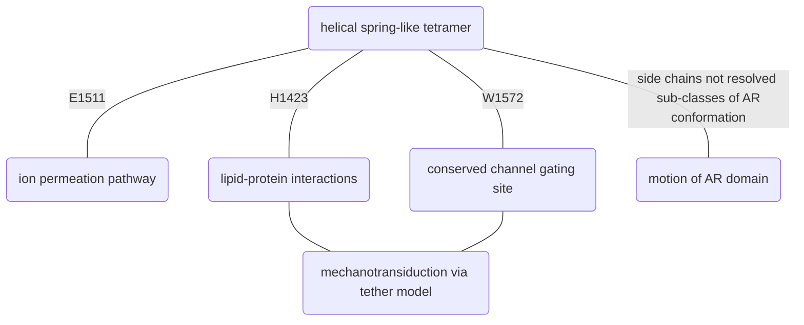

## DAG

```mermaid
flowchart TB

NompC --- |2013_YNJ_Nature| gentle_touch_sensation
gentle_touch_sensation --> |2015_YNJ_Cell| Ankyrin_repeats_convey_force

NompC --> |2017_YFC_Nature| helical_spring_like_tetramer
```

## Lectures

### 2013_YNJ_Nature

```mermaid
flowchart TB

function(gentle-touch sensation)
sufficiency(NompC is sufficient for gentle-touch sensation)
selectivity(non-selectivity cation channels)
necessity(NompC is necessary for gentle-touch sensation)
mutagenesis("E1511K (acidic -> basic) considerably reduced channel activity")

function --- |null mutant| necessity --- |site-directed mutagenesis| mutagenesis
function --- |ectopic/heterologous expression| sufficiency --- |reversal potential measurement| selectivity
```

### 2015_YNJ_Cell

```mermaid
flowchart TB

AR("29 Ankyrin Repeats (AR) convey force")
cytoplasmic(AR is cytoplasmic domain of NompC)
integrity(the integrity of ARs is required for)
surface(NompC surface expression)
function(mechanogating function)
connector(ARs are membrane-microtubules connectors)
microtubules(microtubules is required for NompC mechanogating)
convey(ARs confer mechanosensitivity)
pattern(chimeric channels share similar synergistic \n action of voltage gating and mechanogating)

AR --- |permeabilized antibody immunostain| cytoplasmic
cytoplasmic --- |"deletion/duplication/swapping of ARs"| integrity
integrity --- |"immunostain"| surface
integrity --- |"outside-out patches"| function
cytoplasmic --- |"EM \n WY or duplication of ARs \n statistic of distance"| connector
connector --- |"colocalization \n inhibitor/enhancer to microtubles forming "| microtubules
surface --- convey
function --- |"transfer ARs to Kv channels"| convey
connector --- convey
convey --- |"dose-dependent \n response decay \n inhibitor \n colocalization \n I-V curves under pressure"| pattern
```

### 2017_YFC_Nature

```mermaid
flowchart TB
structure(helical spring-like tetramer)
permeation(ion permeation pathway)
tether(lipid-protein interactions)
gating(conserved channel gating site)
transiduction(mechanotransiduction via tether model)
motion(motion of AR domain)

structure --- |E1511| permeation
structure --- |H1423| tether --- transiduction
structure --- |W1572| gating --- transiduction
structure --- |side chains not resolved \n sub-classes of AR conformation| motion
```
