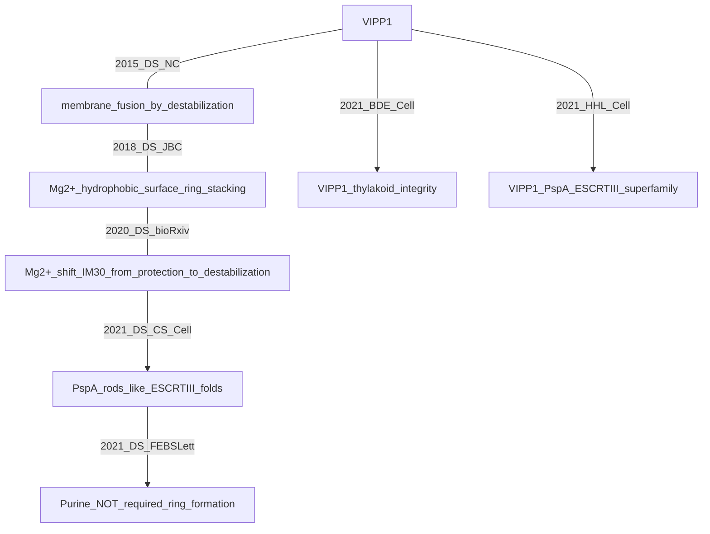
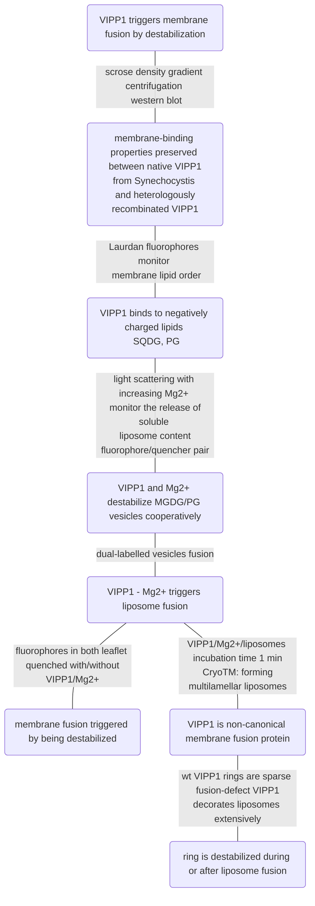
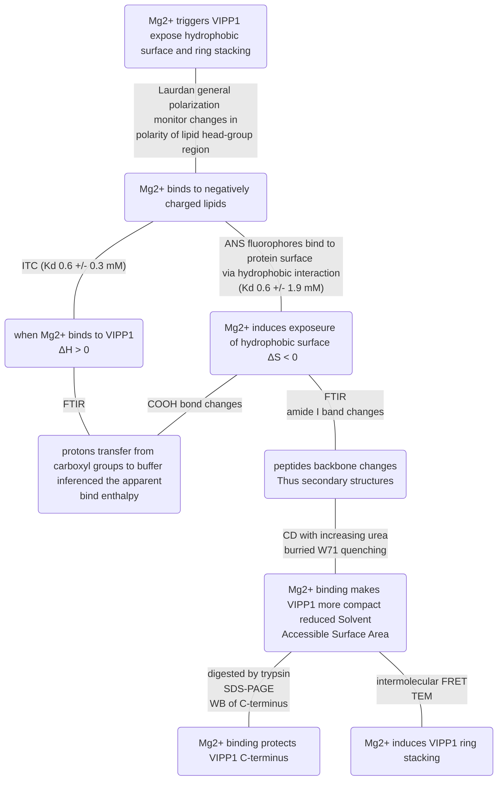
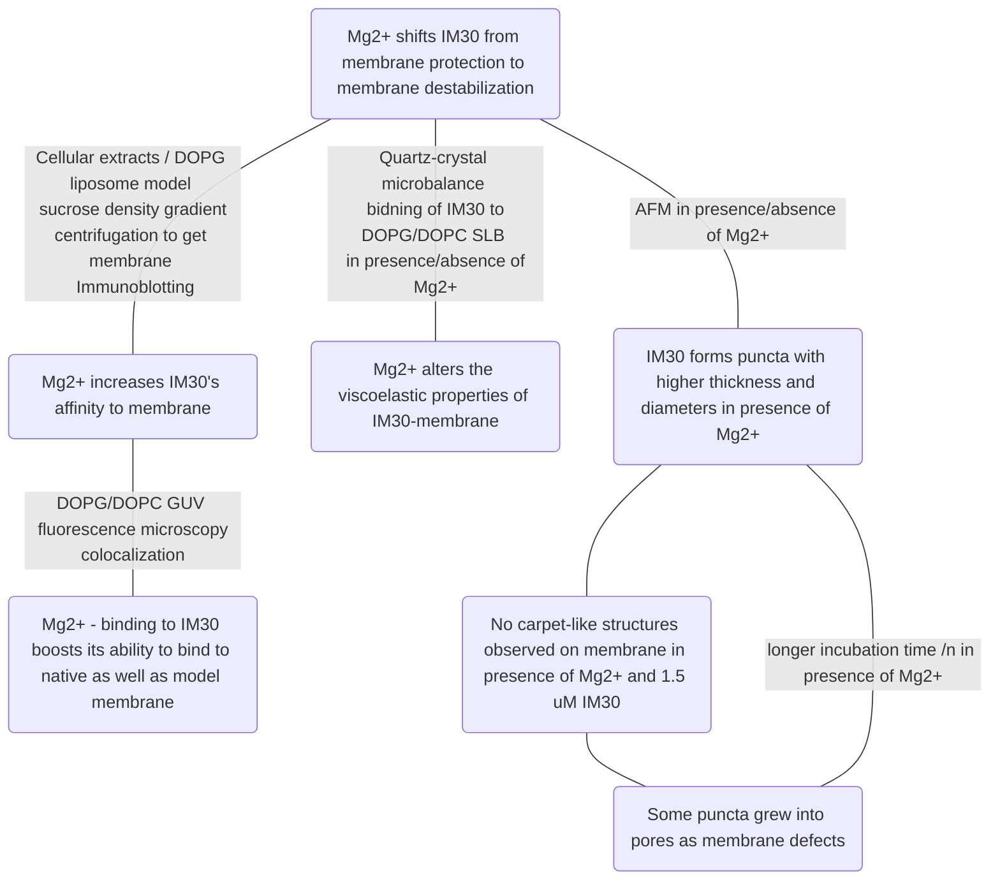
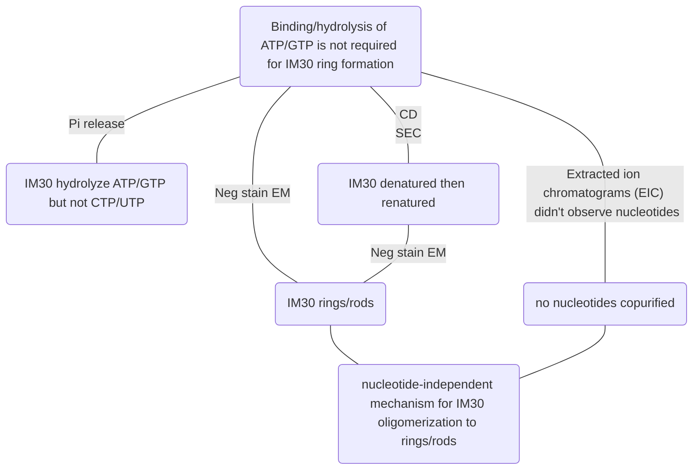
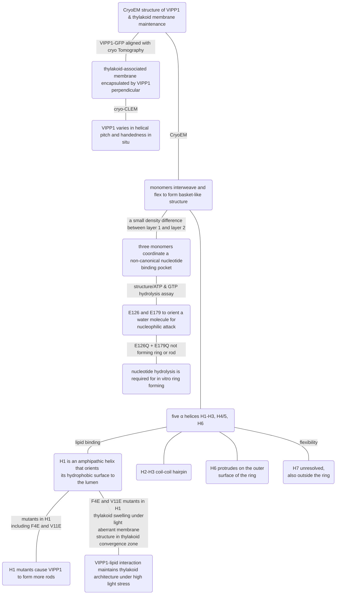
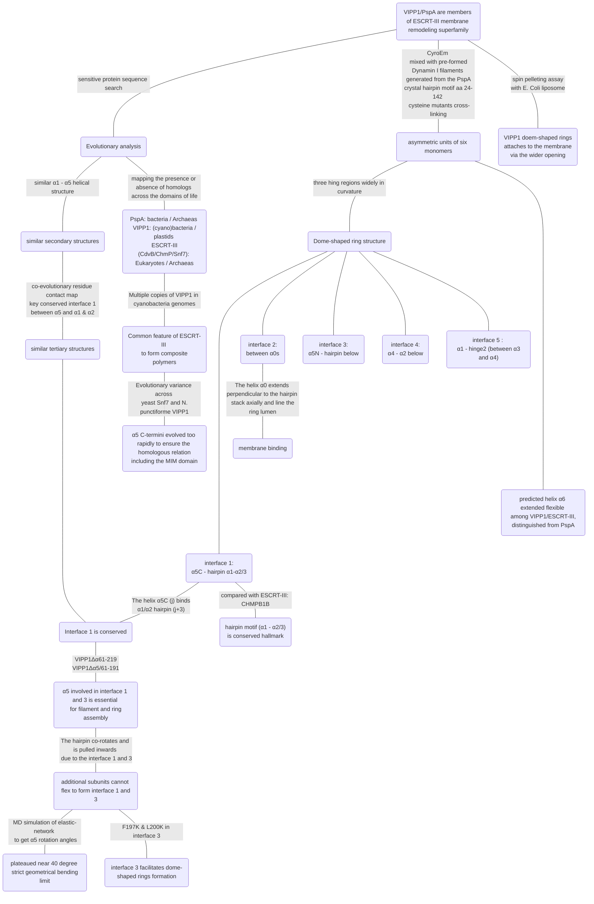
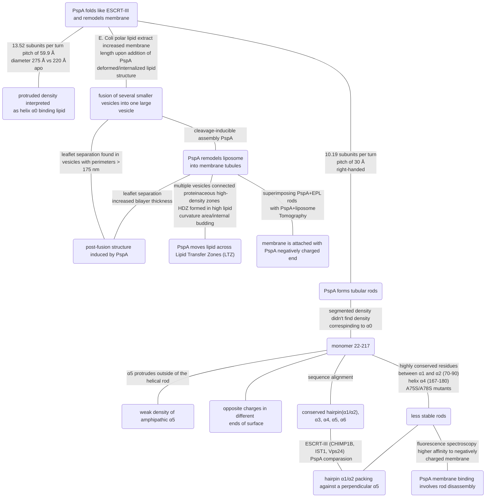

## DAG

```mermaid
flowchart TB

VIPP1 --- |2015_DS_NC| membrane_fusion_by_destabilization
membrane_fusion_by_destabilization --- |2018_DS_JBC| Mg2+_hydrophobic_surface_ring_stacking
Mg2+_hydrophobic_surface_ring_stacking --- |2020_DS_bioRxiv| Mg2+_shift_IM30_from_protection_to_destabilization
Mg2+_shift_IM30_from_protection_to_destabilization ---> |2021_DS_CS_Cell| PspA_rods_like_ESCRTIII_folds
PspA_rods_like_ESCRTIII_folds ---> |2021_DS_FEBSLett| Purine_NOT_required_ring_formation

VIPP1 ---> |2021_BDE_Cell| VIPP1_thylakoid_integrity

VIPP1 ---> |2021_HHL_Cell| VIPP1_PspA_ESCRTIII_superfamily
```

## Lectures

### 2015_DS_NC

```mermaid
flowchart TB

%% OBJECTS==================================================
theme(VIPP1 triggers membrane fusion by destabilization)

preserved(membrane-binding properties preserved \n between native VIPP1 from Synechocystis \n and heterologously recombinated VIPP1)
negativelyChargedLipids(VIPP1 binds to negatively charged lipids \n SQDG, PG)
destabilization(VIPP1 and Mg2+ destabilize MGDG/PG vesicles cooperatively)
fusion(VIPP1 - Mg2+ triggers liposome fusion)
beforeFusion(membrane fusion triggered by being destabilized)

non-canonical(VIPP1 is non-canonical membrane fusion protein)
afterFusion(ring is destabilized during or after liposome fusion)


%% RELATIONS==================================================
theme --- |scrose density gradient centrifugation \n western blot| preserved

preserved --- |Laurdan fluorophores monitor \n membrane lipid order| negativelyChargedLipids
negativelyChargedLipids --- |light scattering with increasing Mg2+ \n monitor the release of soluble \n liposome content fluorophore/quencher pair| destabilization
destabilization --- |dual-labelled vesicles fusion| fusion
fusion --- |fluorophores in both leaflet \n quenched with/without VIPP1/Mg2+| beforeFusion

fusion --- |VIPP1/Mg2+/liposomes \n incubation time 1 min \n CryoTM: forming multilamellar liposomes| non-canonical
non-canonical --- |wt VIPP1 rings are sparse \n fusion-defect VIPP1 decorates liposomes extensively| afterFusion
```

### 2018_DS_JBC

```mermaid
flowchart TB

%% OBJECTS==================================================
theme(Mg2+ triggers VIPP1 expose hydrophobic surface and ring stacking)
negativelyChargedLipids(Mg2+ binds to negatively charged lipids)
ITC(when Mg2+ binds to VIPP1 \n ΔH > 0)
hydrophobicSurface(Mg2+ induces exposeure of hydrophobic surface \n ΔS < 0)
deprotonation(protons transfer from carboxyl groups to buffer \n inferenced the apparent bind enthalpy)
secondaryStructure(peptides backbone changes \n Thus secondary structures)
compact(Mg2+ binding makes VIPP1 more compact \n reduced Solvent Accessible Surface Area)
C-terminus(Mg2+ binding protects VIPP1 C-terminus)
ringStacking(Mg2+ induces VIPP1 ring stacking)


%% RELATIONS==================================================
theme --- |Laurdan general polarization \n monitor changes in polarity of lipid head-group region | negativelyChargedLipids
negativelyChargedLipids --- |"ITC (Kd 0.6 +/- 0.3 mM)"| ITC
negativelyChargedLipids --- |"ANS fluorophores bind to protein surface \n via hydrophobic interaction (Kd 0.6 +/- 1.9 mM)"| hydrophobicSurface
ITC --- |FTIR| deprotonation
hydrophobicSurface --- |COOH bond changes| deprotonation

hydrophobicSurface --- |FTIR \n amide I band changes| secondaryStructure
secondaryStructure --- |CD with increasing urea \n burried W71 quenching| compact
compact --- |digested by trypsin \n SDS-PAGE \n WB of C-terminus| C-terminus
compact --- |intermolecular FRET \n TEM| ringStacking
```

### 2020_DS_bioRxiv

```mermaid
flowchart TB

%% OBJECTS==================================================
theme(Mg2+ shifts IM30 from membrane protection to membrane destabilization)
affinity(Mg2+ increases IM30's affinity to membrane)
ability(Mg2+ - binding to IM30 boosts its ability to bind to native as well as model membrane)
viscoelasticity(Mg2+ alters the viscoelastic properties of IM30-membrane)
puncta(IM30 forms puncta with higher thickness and diameters in presence of Mg2+)
carpet(No carpet-like structures observed on membrane in presence of Mg2+ and 1.5 uM IM30)
defects(Some puncta grew into pores as membrane defects)


%% RELATIONS==================================================
theme --- |Cellular extracts / DOPG liposome model \n sucrose density gradient centrifugation to get membrane \n Immunoblotting| affinity
affinity --- |DOPG/DOPC GUV \n fluorescence microscopy colocalization| ability
theme --- |Quartz-crystal microbalance \n bidning of IM30 to DOPG/DOPC SLB \n in presence/absence of Mg2+| viscoelasticity
theme --- |AFM in presence/absence of Mg2+| puncta
puncta --- carpet
carpet --- defects
puncta --- |longer incubation time /n in presence of Mg2+| defects
```

### 2021_DS_FEBSLett

```mermaid
flowchart TB

%% OBJECTS==================================================
theme(Binding/hydrolysis of ATP/GTP is not required for IM30 ring formation)
specificity(IM30 hydrolyze ATP/GTP but not CTP/UTP)
copurified(no nucleotides copurified)
ringForming(IM30 rings/rods)
denature(IM30 denatured then renatured)
independent(nucleotide-independent mechanism for IM30 oligomerization to rings/rods)


%% RELATIONS==================================================
theme --- |Pi release| specificity
theme --- |"Extracted ion chromatograms (EIC) \n didn't observe nucleotides"| copurified
theme --- |Neg stain EM| ringForming
theme --- |CD \n SEC| denature
denature --- |Neg stain EM| ringForming
ringForming --- independent
copurified --- independent
```

### 2021_BDE_Cell

```mermaid
flowchart TB

%% OBJECTS==================================================
theme(CryoEM structure of VIPP1 & thylakoid membrane maintenance)

structure("monomers interweave and flex to form basket-like structure")
helices("five α helices H1-H3, H4/5, H6")
H1(H1 is an amphipathic helix that orients \n its hydrophobic surface to the lumen)
H2H3(H2-H3 coil-coil hairpin)
H6(H6 protrudes on the outer \n surface of the ring)
H7(H7 unresolved, \n also outside the ring)

nucleotide(three monomers coordinate a \n non-canonical nucleotide binding pocket)
hydrolysis(E126 and E179 to orient a \n water molecule for nucleophilic attack)
ringForming(nucleotide hydrolysis is required for in vitro ring forming)

equilibriumRingRod(H1 mutants cause VIPP1 to form more rods)
maintenance(VIPP1-lipid interaction maintains thylakoid architecture under high light stress)

encapsulation(thylakoid-associated membrane \n encapsulated by VIPP1 perpendicular)
pitchHandedness(VIPP1 varies in helical \n pitch and handedness in situ)


%% RELATIONS==================================================
theme ------ |CryoEM| structure

structure ------ helices
helices --- |lipid binding| H1
helices --- H2H3
helices --- H6
helices ---|flexibility| H7

structure ---|a small density difference between layer 1 and layer 2| nucleotide
nucleotide --- |structure/ATP & GTP hydrolysis assay| hydrolysis
hydrolysis --- |E126Q + E179Q not forming ring or rod| ringForming

H1 --- |mutants in H1 \n including F4E and V11E| equilibriumRingRod
H1 --- |F4E and V11E mutants in H1 \n thylakoid swelling under light \n aberrant membrane structure in thylakoid convergence zone| maintenance

theme --- |VIPP1-GFP aligned with cryo Tomography| encapsulation
encapsulation --- |cryo-CLEM| pitchHandedness
```

### 2021_HHL_Cell

```mermaid
flowchart TB

%% OBJECTS==================================================
theme(VIPP1/PspA are members of ESCRT-III membrane remodeling superfamily)

evolutionary(Evolutionary analysis)
secondary(similar secondary structures)
tertiary(similar tertiary structures)
phylogenetic("PspA: bacteria / Archaeas \n VIPP1: (cyano)bacteria / plastids \n ESCRT-III (CdvB/ChmP/Snf7): Eukaryotes / Archaeas")
multipleCopies(Common feature of ESCRT-III \n to form composite polymers)
evolutionaryVariance(α5 C-termini evolved too rapidly to ensure the \n homologous relation including the MIM domain)

asymmetricUnit(asymmetric units of six monomers)
structure(Dome-shaped ring structure)
interface1(interface 1: \n α5C - hairpin α1-α2/3)
interface2(interface 2: \n between α0s)
interface3(interface 3: \n α5N - hairpin below)
interface4(interface 4: \n α4 - α2 below)
interface5("interface 5 : \n α1 - hinge2 (between α3 and α4)")

alpha0(membrane binding)

alpha5(Interface 1 is conserved)
assemblyEssential(α5 involved in interface 1 and 3 is essential \n for filament and ring assembly)
co-rotate(additional subunits cannot \n flex to form interface 1 and 3)
geometricLimit(plateaued near 40 degree \n strict geometrical bending limit)
domeFaciliated(interface 3 facilitates dome-shaped rings formation)

hairpin("hairpin motif (α1 - α2/3) \n is conserved hallmark")
alpha6(predicted helix α6 extended flexible \n among VIPP1/ESCRT-III, distinguished from PspA)

membraneRemodeling(VIPP1 doem-shaped rings \n attaches to the membrane \n via the wider opening)


%% RELATIONS==================================================
theme --- |sensitive protein sequence search| evolutionary
evolutionary --- |similar α1 - α5 helical structure| secondary
secondary --- |co-evolutionary residue contact map \n key conserved interface 1 between α5 and α1 & α2| tertiary
evolutionary --- |mapping the presence or absence of homologs across the domains of life| phylogenetic
phylogenetic --- |Multiple copies of VIPP1 in cyanobacteria genomes| multipleCopies
multipleCopies --- |Evolutionary variance across \n yeast Snf7 and N. punctiforme VIPP1| evolutionaryVariance

theme --- |CyroEm \n mixed with pre-formed Dynamin I filaments \n generated from the PspA crystal hairpin motif aa 24-142 \n cysteine mutants cross-linking| asymmetricUnit
asymmetricUnit ---|three hing regions widely in curvature| structure
structure ------ interface1
structure --- interface2
structure --- interface3
structure --- interface4
structure --- interface5
asymmetricUnit ------ alpha6

interface1 --- |"The helix α5C (j) binds \n α1/α2 hairpin (j+3)"| alpha5
alpha5 --- |VIPP1Δα61-219 \n VIPP1Δα5/61-191| assemblyEssential
assemblyEssential --- |The hairpin co-rotates and is pulled inwards \n due to the interface 1 and 3| co-rotate
co-rotate --- |MD simulation of elastic-network \n to get α5 rotation angles| geometricLimit
co-rotate --- |F197K & L200K in interface 3| domeFaciliated

interface1 --- |compared with ESCRT-III: CHMPB1B| hairpin
interface2 --- |The helix α0 extends perpendicular to the hairpin \n stack axially and line the ring lumen| alpha0

theme --- |spin pelleting assay \n with E. Coli liposome| membraneRemodeling

tertiary ------ alpha5
```

### 2021_DS_CS_Cell

```mermaid
flowchart TB

%% OBJECTS==================================================
theme(PspA folds like ESCRT-III and remodels membrane)

structure(PspA forms tubular rods)
structureLipid(protruded density interpreted \n as helix α0 binding lipid)

monomerStructure(monomer 22-217)
alpha5(weak density of amphipathic α5)
charges(opposite charges in different \n ends of surface)
conservedMotif("conserved hairpin(α1/α2), \n α3, α4, α5, α6")
conservedPacking(hairpin α1/α2 packing against a perpendicular α5)

unstableRods(less stable rods)
disassembly(PspA membrane binding involves rod disassembly)

fusion(fusion of several smaller \n vesicles into one large vesicle)
postFusion(post-fusion structure induced by PspA)
LTZ("PspA moves lipid across Lipid Transfer Zones (LTZ)")

remodel(PspA remodels liposome \n into membrane tubules)
attaches(membrane is attached with PspA negatively charged end)


%% RELATIONS==================================================
theme ------ |10.19 subunits per turn \n pitch of 30 Å \n right-handed| structure
theme --- |13.52 subunits per turn \n pitch of 59.9 Å \n diameter 275 Å vs 220 Å apo| structureLipid
structure --- |segmented density \n didn't find density correspinding to α0| monomerStructure
monomerStructure --- |α5 protrudes outside of the helical rod| alpha5
monomerStructure --- |sequence alignment| conservedMotif
monomerStructure --- |"highly conserved residues \n between α1 and α2 (70-90) \n helix α4 (167-180) \n A75S/A78S mutants"| unstableRods

conservedMotif --- |"ESCRT-III (CHIMP1B, IST1, Vps24) \n PspA comparasion"| conservedPacking
unstableRods --- conservedPacking
unstableRods --- |fluorescence spectroscopy \n higher affinity to negatively charged membrane| disassembly

monomerStructure --- charges

theme --- |E. Coli polar lipid extract \n increased membrane length upon addition of PspA \n deformed/internalized lipid structure| fusion
fusion --- |cleavage-inducible assembly PspA| remodel
fusion --- |leaflet separation found in \n vesicles with perimeters > 175 nm| postFusion
remodel --- |leaflet separation \n increased bilayer thickness| postFusion
remodel --- |superimposing PspA+EPL rods \n with PspA+liposome Tomography| attaches
remodel --- |multiple vesicles connected \n proteinaceous high-density zones \n HDZ formed in high lipid curvature area/internal budding| LTZ
```
