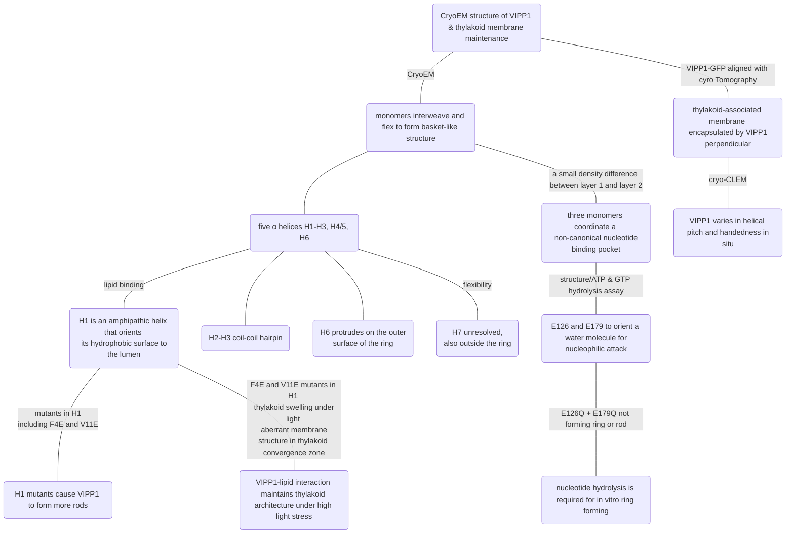
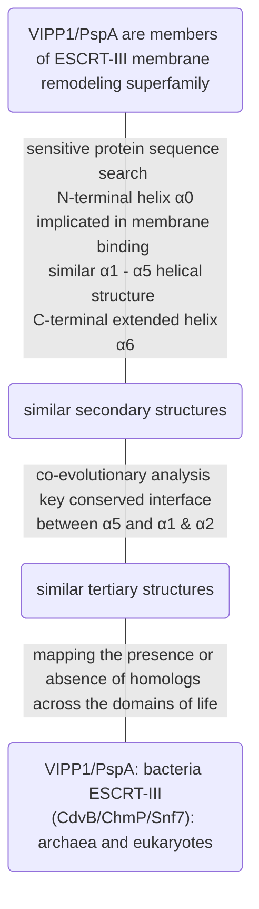

## DAG

## Lectures

### 2021_BDE_Cell

```mermaid
flowchart TB
theme(CryoEM structure of VIPP1 & thylakoid membrane maintenance)

structure("monomers interweave and flex to form basket-like structure")
helices("five α helices H1-H3, H4/5, H6")
H1(H1 is an amphipathic helix that orients \n its hydrophobic surface to the lumen)
H2H3(H2-H3 coil-coil hairpin)
H6(H6 protrudes on the outer \n surface of the ring)
H7(H7 unresolved, \n also outside the ring)

nucleotide(three monomers coordinate a \n non-canonical nucleotide binding pocket)
hydrolysis(E126 and E179 to orient a \n water molecule for nucleophilic attack)
ringForming(nucleotide hydrolysis is required for in vitro ring forming)

equilibriumRingRod(H1 mutants cause VIPP1 to form more rods)
maintenance(VIPP1-lipid interaction maintains thylakoid architecture under high light stress)

encapsulation(thylakoid-associated membrane \n encapsulated by VIPP1 perpendicular)
pitchHandedness(VIPP1 varies in helical \n pitch and handedness in situ)

theme --- |CryoEM| structure

structure --- helices
helices --- |lipid binding| H1
helices --- H2H3
helices --- H6
helices ---|flexibility| H7

structure ---|a small density difference between layer 1 and layer 2| nucleotide
nucleotide --- |structure/ATP & GTP hydrolysis assay| hydrolysis
hydrolysis --- |E126Q + E179Q not forming ring or rod| ringForming

H1 --- |mutants in H1 \n including F4E and V11E| equilibriumRingRod
H1 --- |F4E and V11E mutants in H1 \n thylakoid swelling under light \n aberrant membrane structure in thylakoid convergence zone| maintenance

theme --- |VIPP1-GFP aligned with cyro Tomography| encapsulation
encapsulation --- |cryo-CLEM| pitchHandedness
```

### 2021_HHL_Cell

```mermaid
flowchart TB
theme(VIPP1/PspA are members of ESCRT-III membrane remodeling superfamily)

secondary(similar secondary structures)
tertiary(similar tertiary structures)
phylogenetic("VIPP1/PspA: bacteria \n ESCRT-III (CdvB/ChmP/Snf7): archaea and eukaryotes")

theme --- |sensitive protein sequence search \n N-terminal helix α0 implicated in membrane binding \n similar α1 - α5 helical structure \n C-terminal extended helix α6| secondary
secondary --- |co-evolutionary analysis \n key conserved interface between α5 and α1 & α2| tertiary
tertiary --- |mapping the presence or absence of homologs across the domains of life| phylogenetic
```
