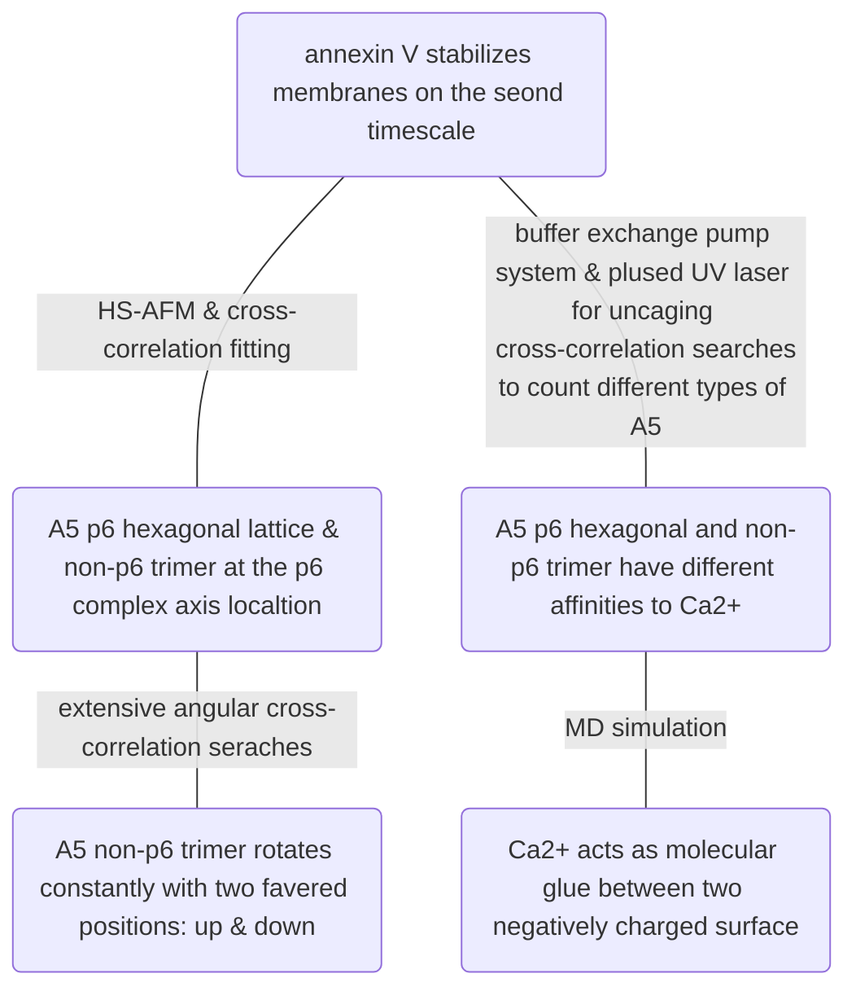
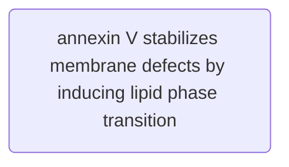

## DAG

## Lectures

### 2016_SS_Nature nanotechnology

```mermaid
flowchart TB
function(annexin V stabilizes membranes on the seond timescale)
lattice(A5 p6 hexagonal lattice & non-p6 trimer at the p6 complex axis localtion)
non-p6(A5 non-p6 trimer rotates constantly with two favered positions: up & down)
affinity(A5 p6 hexagonal and non-p6 trimer have different affinities to Ca2+)
glue(Ca2+ acts as molecular glue between two negatively charged surface)

function --- |"HS-AFM & cross-correlation fitting"| lattice --- |"extensive angular cross-correlation seraches"| non-p6
function --- |"buffer exchange pump system & plused UV laser for uncaging \n cross-correlation searches to count different types of A5"| affinity --- |"MD simulation"| glue
```

### 2020_SS_Nature communications

```mermaid
flowchart TB
function(annexin V stabilizes membrane defects by inducing lipid phase transition)
```
