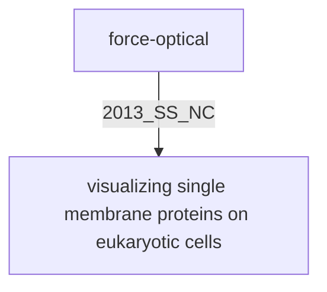
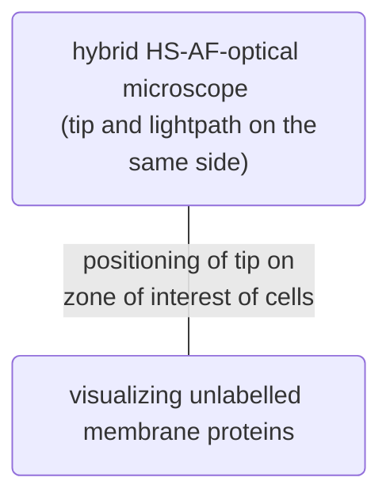

## DAG

```mermaid
flowchart TB

force-optical --> |2013_SS_NC| 2013_SS_NC[visualizing single membrane proteins on eukaryotic cells]
```

## Lectures

### 2013_SS_NC

```mermaid
flowchart TB
hybrid("hybrid HS-AF-optical microscope \n (tip and lightpath on the same side)")
visualizing(visualizing unlabelled membrane proteins)
hybrid --- |positioning of tip on \n zone of interest of cells| visualizing
```
