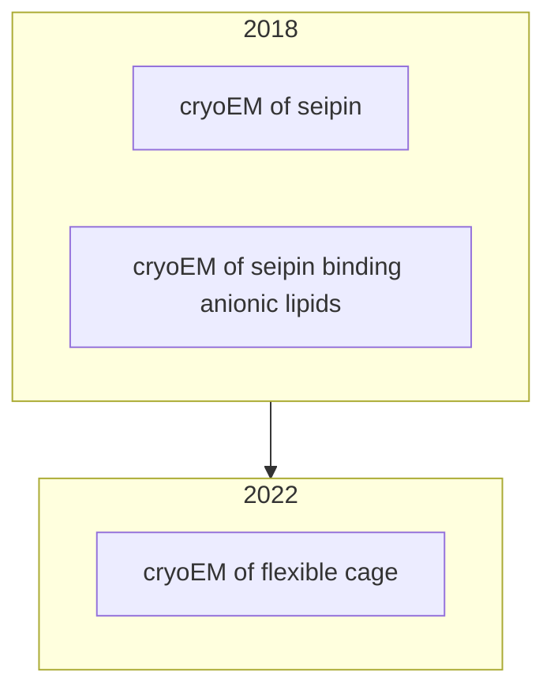
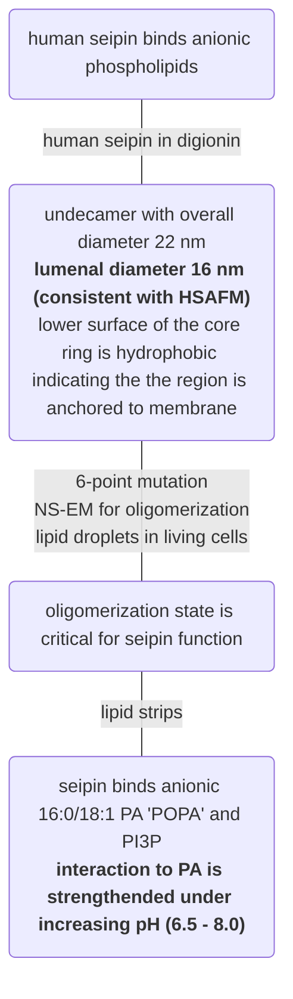
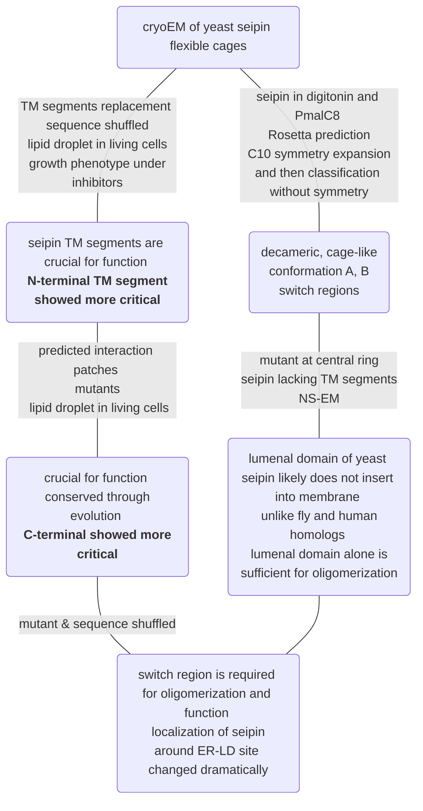

## Seipin ##

uniport: Q640F1

spcies: Xenopus laevis (African clawed frog) in [homologous comparison](./seipin#cryoem_jcb).

Evolutinoarily conserved: ER-lumenal domain; flanking transmembrane (TM) segments, switch region (within TM segments)

Less conserved: cytoplasmic N- and C-terminal regions; lengths vary among species
([homologous comparison](./seipin#cage))

## Potential to do ##

1. [Alphafold Multimer](https://cosmic-cryoem.org/tools/alphafoldmultimer/) of seipin (X. laevis)
2. CNN to remove double-tip artifacts
3. glycosylation / glycerolipids?

## Timeline ##

### 2018_cryoEM_JCB ###

Sui, Xuewu, et al. "Cryo–electron microscopy structure of the lipid droplet–formation protein seipin." Journal of Cell Biology 217.12 (2018): 4080-4091.

### 2018_anionic ###

Yan, Renhong, et al. "Human SEIPIN binds anionic phospholipids." Developmental cell 47.2 (2018): 248-256.

### 2022_cage ###

Arlt, Henning, et al. "Seipin forms a flexible cage at lipid droplet formation sites." Nature structural & molecular biology 29.3 (2022): 194-202.

