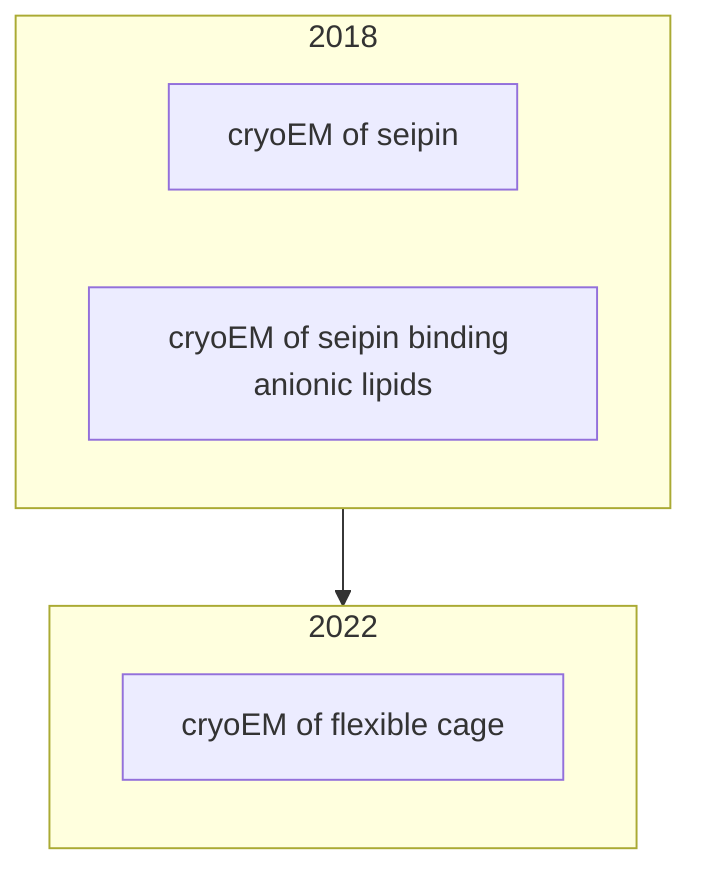

## Seipin ##

uniport: Q640F1

spcies: Xenopus laevis (African clawed frog) in [homologous comparison](./seipin#cryoem_jcb).

## Potential to do ##

1. [Alphafold Multimer](https://cosmic-cryoem.org/tools/alphafoldmultimer/) of seipin (X. laevis)
2. CNN to remove double-tip artifacts

## Timeline ##

### 2018_cryoEM_JCB ###

### 2018_anionic ###

### 2022_cage ###

