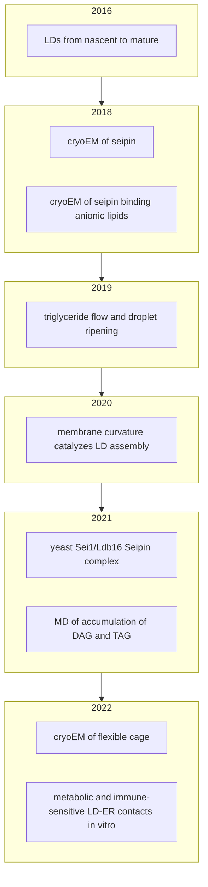
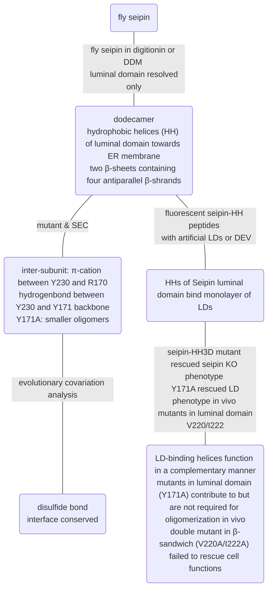
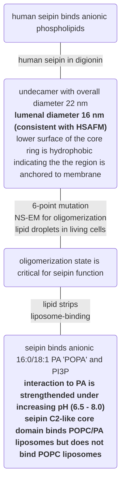
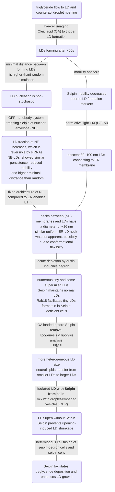
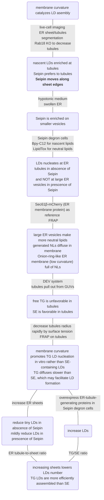
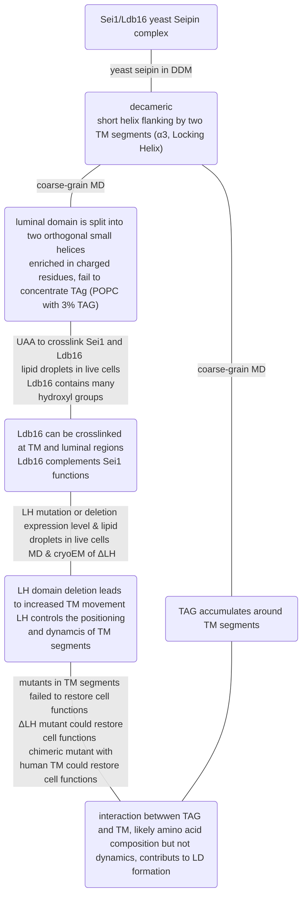
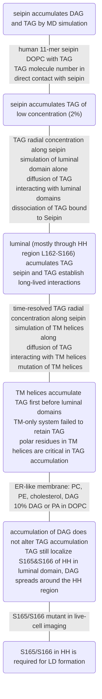
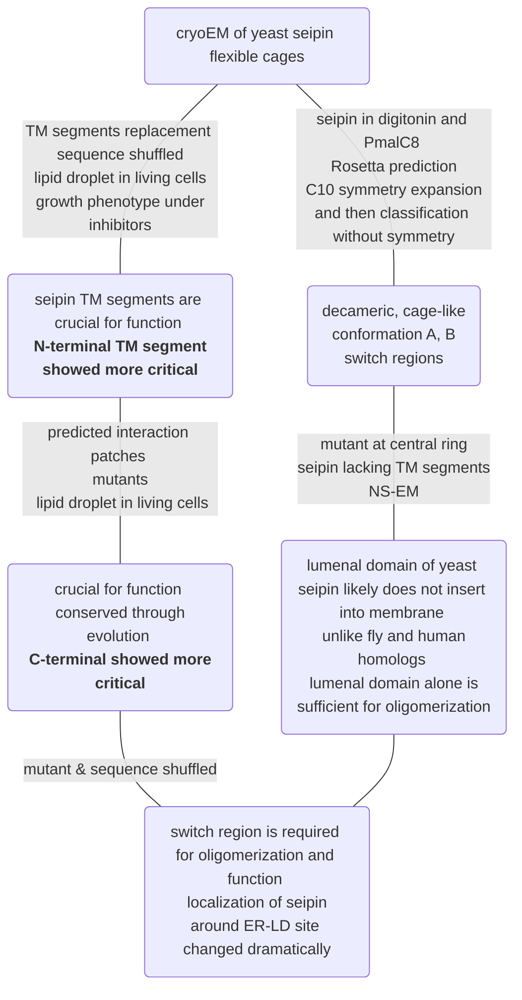
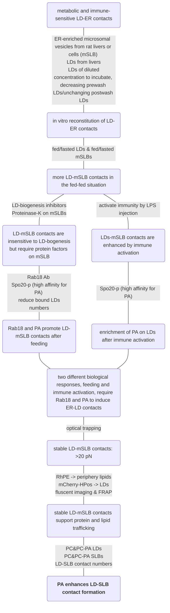

## Seipin ##

uniport: Q640F1

MW: 37 kD (seipin) + 8 kD (LDAF1) + n(?) x 1 kD (FLAG-tag) \
Seipin + LDAF1 = 45 kD (subunit)

PI: 5.77

spcies: Xenopus laevis (African clawed frog) in [homologous comparison](./seipin#cryoem_jcb).

Evolutinoarily conserved: ER-lumenal domain; flanking transmembrane (TM) segments, switch region (within TM segments)

Less conserved: cytoplasmic N- and C-terminal regions; lengths vary among species
([homologous comparison](./seipin#cage))

diameter: 14 nm (from HS-AFM)\
top area: 154 nm2

POPC head area: 0.7 nm2 \
MW: 760

number of lipids to fill Seipin chamber:

154/0.7\*2 = 440 (mol/mol, lipid:Seipin 11mer) \
154/0.7\*2/11 = 40 (mol/mol, lipid:Seipin subunit)

LPR = 40 * 0.76 / 45 = **0.68** (w/w, lipid:Seipin-LDAF1 subunit), \
weight concentration (mg/mL) is independent on oligomeric states.

## Potential to do ##

- [ ] triglycerides or cholesterol added to reconstitute Seipin
- [ ] glycosylation / glycerolipids?
- [x] **(lower LPR)** reconstitution (POPC/DOPE/DOPS for ER membrane proteins) / high affinity for PA\
        (Seipin may need a higher LPR because of its empty hydrophobic chamber)
- [x] [Alphafold Multimer](https://cosmic-cryoem.org/tools/alphafoldmultimer/) of seipin (X. laevis)
- [ ] ~~algorithm to remove double-tip artifacts~~
- [ ] ~~crosslinking (mica - APTES - NES-PEG & SMCC - reconstituted Seipin)~~\
        (detergent micelles on cytosolic side?)

## Timeline ##

### 2016_nascent_mature ###

Wang, Huajin, et al. "Seipin is required for converting nascent to mature lipid droplets." elife 5 (2016): e16582.

```mermaid
flowchart TB

%% OBJECTS====================
theme("seipin is required for LD maturation")

deficiency("Seipin deficiency leads to LD altered morphology
without evidence for altered lipid metabolism (including cellular PA levels)")

LiveDrop("small LiveDrop puncta are more mobile in Seipin KD
LiveDrop localization to LDs depends on TG synthesis")

conserved("Seipin conserved regions (TM and luminal domains) are required for functions")

LD-ER("nascent LDs were close proximity to but separated from the ER
filamentous structures between LDs and ER in Seipin KO cells
LD-ER contact sites space lacks ribosomes")

seipin("Seipin are highly mobile along the ER before LD formation
Seipin co-localized with LiveDrop puncta shortly and became less mobile
majority of LDs are associated with Seipin")

GPAT4("nascent, abnormal LDs recruit GPAT4 targeting to LDs at early time
initiating TG synthesis and LD expansion")

phospholipids("Giant LDs of Seipin-deficient cells are deficient in phospholipids")

%% RELATIONS====================
theme --- |fly and human cells <br/> RNAi,CRISPR/Cas9 to knock down <br/> live-cell imaging <br/> 14C labelling lipidomics| deficiency
deficiency --- |LiveDrop - more sensitive to TG <br/> small, abnormal LDs: LiveDrop+ & BODIPY- <br/> TG synthesis inhibitors| LiveDrop
LiveDrop --- |cells from BSCL2 mutation patients <br/> Seipin truncations to rescue LD phenotype in Seipin KD cells <br/> expression of human Seipin prevents Seipin depletion phenotypes| conserved
conserved --- |ET| LD-ER
LD-ER --- |GFP-Seipin & LiveDrop <br/> live-cell imaging| seipin
seipin --- |GPAT4 co-licalizes with LDs <br/> knock down TG synthesis enzymes| GPAT4
GPAT4 --- |"14C-oleic acid <br/> gradient centrifugation to get LD lipids <br/> CCT(PC synthesis enzyme) are recruited to LDs <br/> add PC liposomes to rescue phenotypes <br/> inhibition of CCT aggravates phenotypes"| phospholipids
```

### 2018_cryoEM_JCB ###

Sui, Xuewu, et al. "Cryo–electron microscopy structure of the lipid droplet–formation protein seipin." Journal of Cell Biology 217.12 (2018): 4080-4091.

### 2018_anionic ###

Yan, Renhong, et al. "Human SEIPIN binds anionic phospholipids." Developmental cell 47.2 (2018): 248-256.

### 2019_triglyceride ###

Salo, Veijo T., et al. "Seipin facilitates triglyceride flow to lipid droplet and counteracts droplet ripening via endoplasmic reticulum contact." Developmental cell 50.4 (2019): 478-493.

*Seipin may facilitate the growth of LDs, with suggested functions in regulating the enzyme machinery of de novo lipogenesis or phosphatidic acid metabolism.*

### 2020_curvature ###

many Seipin-collaborating proteins are membrane curvature sensors or inducers (PEX30/MCTP2, promethin, Ldo16/45, LDIP)

ER-LD marker peptide HPos?

### 2021_sei1 ###

Klug, Yoel A., et al. "Mechanism of lipid droplet formation by the yeast Sei1/Ldb16 Seipin complex." Nature communications 12.1 (2021): 5892.

*Seipin rings not in contact with lenses are highly mobile in the ER*

### 2021_accumulation_MD ###

Zoni, Valeria, et al. "Seipin accumulates and traps diacylglycerols and triglycerides in its ring-like structure." Proceedings of the National Academy of Sciences 118.10 (2021): e2017205118.

*N_terminal domain is proposed in relation to PA homeostasis*

### 2022_cage ###

Arlt, Henning, et al. "Seipin forms a flexible cage at lipid droplet formation sites." Nature structural & molecular biology 29.3 (2022): 194-202.

### 2022_LDER_contact ###

Kamerkar, Sukrut, et al. "Metabolic and immune-sensitive contacts between lipid droplets and endoplasmic reticulum reconstituted in vitro." Proceedings of the National Academy of Sciences 119.24 (2022): e2200513119.

